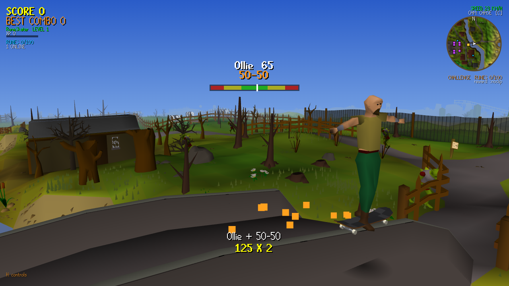
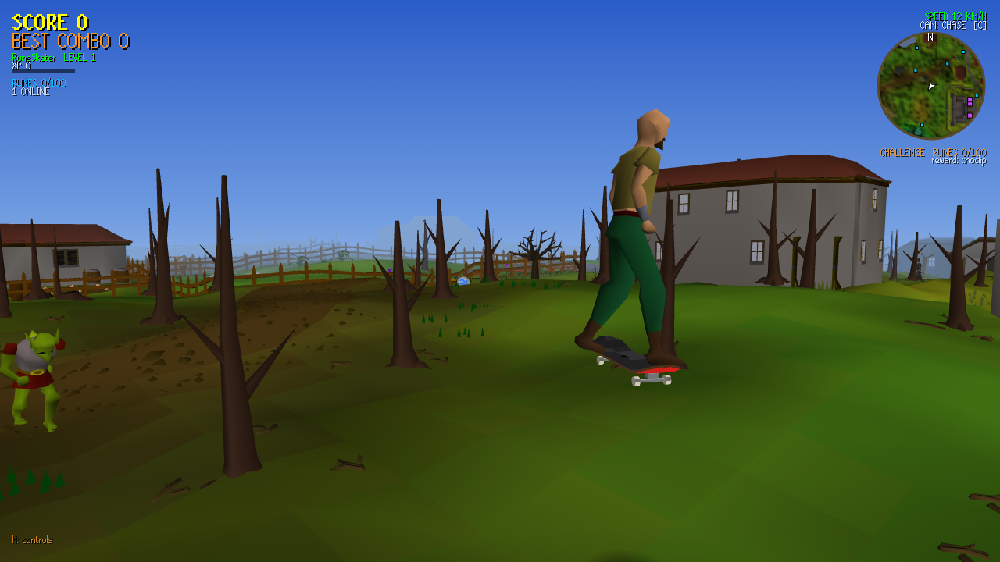
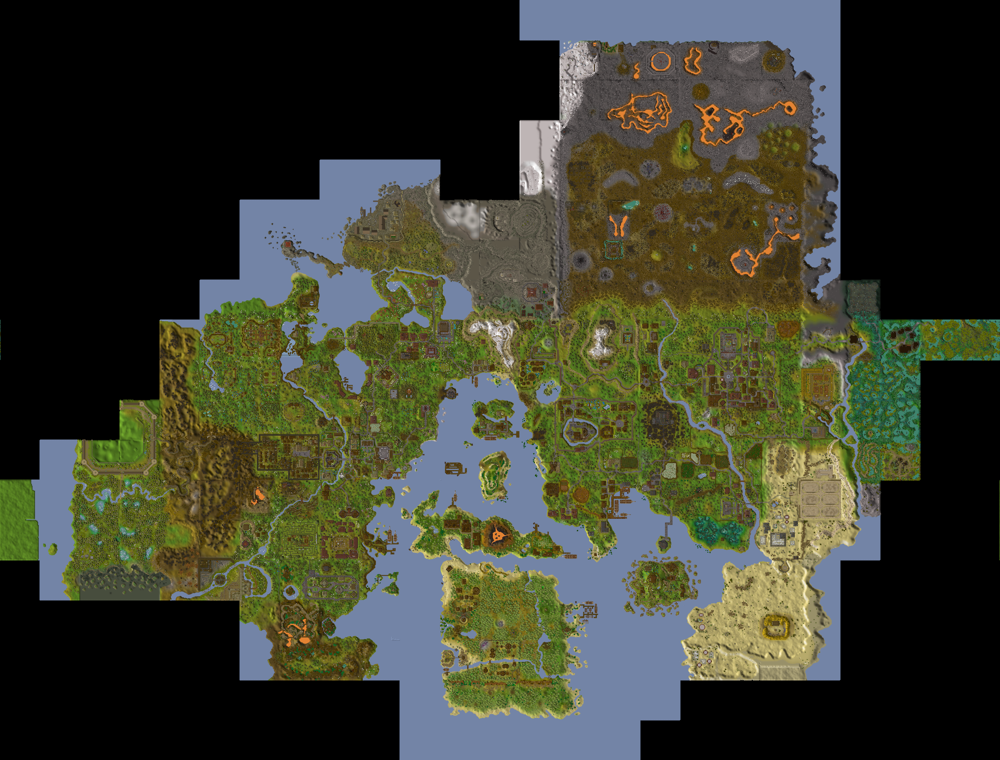

# RuneSkate

**A multiplayer skateboarding game set in 2004 RuneScape.** Push, ollie, kickflip and grind your way across
the whole 2004 world, free-to-play AND members: Lumbridge, Varrock, Falador, the Wilderness, Ardougne, Camelot,
Yanille, Karamja, Canifis, the Gnome Stronghold, the desert and more, rebuilt tile-for-tile from the game's own
map data and running in the browser. Every door and gate stands open.





## What's in it

- **Skate 3's physics model.** The skater follows the model reverse-engineered by the Rust/Bevy Skate 3 rebuild
  ([SK8-ENGINE/skate-3-rust-engine](https://github.com/SK8-ENGINE/skate-3-rust-engine)): push gains capped by a
  speed-blended limit, a rolling-friction curve that slopes override (no sticking on hills), trucks that ease into
  a lean, flick-it pops whose strength is the flick's SPEED, pop height that grows with speed, spins that wind up,
  landings resolved against the ground normal (land down a bank and keep your speed) and judged sketchy from spin
  rate and sideways speed. Skate 3's own tuning tables are EA's game data (that project loads them from your ISO),
  so the numbers here are tuned for this map; written clean-room from a description of its behaviour.
- **A human body in RS style.** Your RS player, same low-poly parts, colours and outfit items, skinned to a
  human skeleton built from RS's own bone labels: realistic proportions (longer legs, a smaller head, a deck the
  right size underneath), knees, elbows, hips and shoulders that bend smoothly instead of cracking, feet of their
  own and a back that curves. Walking and emotes are retargeted onto the same body.
- **A real skater on the board.** The body is posed by two-bone IK with the feet locked to the deck: crouch for
  the pop, the front foot slides up the nose, knees tuck in the air, the back foot plants and drags to push, arms
  balance on a grind. The board tips to the ground under its four wheels (slopes, kerbs).
- **Ragdoll bails, Hall of Meat.** A bail hands the pose over to a verlet ragdoll: muscles hold the shape for a
  moment and fade to limp, the arms reach out to break the fall, then the body tumbles, slides and comes to rest.
  The stick still steers it. Impacts are scored by body part and bones can break. The board flies off on its own,
  bounces, and once it lands wheels-down it rolls away (downhill too).
- **Light and sound.** A sun that casts shadows around you, a 40-minute day/night cycle, and wheel sound that
  changes with the ground (stone, wood, grass, dirt, sand), grinds that sound like what they're on, and pad
  rumble. Slow machines drop to the old flat look by themselves (G toggles it).
- **Tricks.** Pushing, carving, powerslides, manuals, grabs, 360s and a flip-trick set (kickflip, heelflip,
  shove-it, varial, 360 flip, hardflip...). Combos chain across grinds and manuals.
- **Fair scoring.** A banked combo is its points x the number of tricks, capped at x10; the same trick repeated in
  one combo is worth half each time, and anything you can hold forever (a looping grind, an endless manual) fades
  out after 6 s. Highscores have no ceiling; the server rate-limits XP so a hacked client can't post billions.
- **Monsters matter.** Each monster needs a skate level to knock out (goblins at 1, demons in the 40s, the King
  Black Dragon at 90). First kills and kill milestones (10/50/100/500) pay big XP bonuses, and re-killing the same
  spawn soon after pays less.
- **Grind anything that looks grindable.** Bridge parapets, fences, low walls and hedges, measured from the
  real geometry. Grinds carry round corners and across small gaps.
- **The real map.** Every wall, gate, tree and river comes from the server's own collision data. Trees
  collide at the trunk, not the tile, and flowers, stumps and fungus are ridden straight over.
- **Multiplayer.** Everyone on one server, with chat, emotes, outfits and a leaderboard.
- **Replay editor.** X opens the last 30 seconds: scrub, slow-mo down to 1/8x, four cameras (follow, tripod,
  low fisheye, orbit), mark in and out, and V saves the clip as a `.webm` video, recorded in the browser.
- **Create-a-Park.** P opens build mode: drop rails, ledges and kickers into the world for everyone (12 pieces
  each, kept in `data/parks.json`). Rails and ledges grind; kickers launch you.
- **Game of S.K.A.T.E.** `::skate Name` challenges someone online, `::accept` takes it. Set a trick and ride it
  away; they have to match it or take a letter. The winner gets XP.
- **Own the spot.** The best combo banked at each challenge spot owns it, with your name floating over it for
  everyone, until someone beats it.
- **Things to do.** 100 hidden runes and a set of challenge spots across the map, goblins to stomp, and
  portals to every town (stop on a portal's pad for a second to go; riding past never teleports you).
  Collect all 100 runes (the real 2004 rune stones) to unlock `::noclip`.
- **Live map** at `/map`: the whole world with runes, portals, challenges and everyone online.



## Controls

| Key | Action |
|---|---|
| W / S | push / brake (W always pushes toward the camera) |
| A / D | steer |
| SPACE | hold + release to ollie |
| J K L I | kickflip, heelflip, shove-it, varial |
| U N M Y B | 360 flip, hardflip, 360 shove-it, double kickflip, double heelflip |
| Mouse | pull down, flick up: ollie (up-left kickflip, up-right heelflip) |
| SHIFT | powerslide |
| Q | manual when rolling (balance with W/S), grab in the air (A/D picks the grab) |
| C / R / E / O | camera / back to spawn / step off the board / outfit |
| 1-5, ENTER, TAB | emotes, chat, leaderboard |
| X | replay editor (SPACE play, arrows scrub/speed, C camera, [ ] in/out, V save video) |
| P | build mode (1 rail, 2 ledge, 3 kicker, [ ] length, R turn, F build, Backspace remove) |
| G | graphics high / low |
| `::skate Name` | challenge someone to S.K.A.T.E. (`::accept`, `::quit`) |

A gamepad works too. Press **H** in game for the full list.

## Running it

You need [Bun](https://bun.sh).

```bash
bun serve.ts 8123          # then open http://localhost:8123/?name=YourName
```

Anyone who opens the URL with a new name is signed up on the spot (`?name=You&password=secret` works as a
join link). Accounts (hashed passwords, outfits, XP, runes, challenges) live in `data/accounts.json`, Create-a-Park
pieces in `data/parks.json` and spot owners in `data/spots.json`; `data/` is never committed. Everything runs
on the one Bun process: no database, no outside services, and every library is vendored in `vendor/`.

Optional environment variables:

| Variable | Meaning |
|---|---|
| `RUNESKATE_OWNER` | login of the server owner's account: crown, `[OWNER]` tag, gilded kit, `::noclip` |
| `RUNESKATE_OWNER_NAME` | display name for the owner account (you still log in as `RUNESKATE_OWNER`) |
| `RUNESKATE_RESERVED` | extra comma-separated names nobody may register |
| `RUNESKATE_DATA` | where the `data/` files live (default `./data`; the tests use a temp dir) |

`bun tools/compress.ts` pre-compresses the assets (`.br`/`.gz`) for much faster loading over the internet.

## Development

- `bun test/sim.js` runs the headless physics checks (collisions, grinds, rune placement, regions, ragdoll, board).
- `bun test/net.js` starts the server on a spare port and plays it: S.K.A.T.E. turns, park limits, spot claims.
- `bun tools/spot-check.ts` checks every challenge spot is reachable from spawn.
- `bun tools/pocket-check.ts` (after split) checks spawn and every portal drop land in a big connected area, never a pocket you cannot skate out of.
- `src/skater.js` is the physics, `src/world.js` the collision world, `src/main.js` the client,
  `serve.ts` the server (static files, accounts, multiplayer relay).

### Rebuilding the world

`assets/` is already built, so you only need this to change the map itself (collision, trees, lanes, runes).
Everything it needs is in this repo: the 2004 game cache (`tools/cache/`), the server's collision, map-object
and spawn data (`tools/data/`), and the parts of the [LostCity](https://github.com/LostCityRS) web client
that read them (`third_party/webclient/`, MIT). You need Bun and Python 3 with `numpy` (plus `Pillow` for
the map image).

```bash
bun install                                                        # fflate, for the exporters
bun --preload ./tools/preload.ts tools/export-world.ts 2048 2816 1600  # terrain + objects (F2P + members) -> tools/out
bun --preload ./tools/preload.ts tools/small-locs.ts                   # tiny objects, tree tiles, doors/gates to open
python tools/build.py        # meshes, collision, rails, tree trunks -> assets/world.*
python tools/lanes.py        # forest skate lanes, water vs rock
python tools/split.py        # cut into the core + streamed region packs
python tools/fixrunes.py     # check every rune still sits on open ground (--write to move them)
python tools/mapimg.py       # the world map image
bun tools/compress.ts        # optional: .br/.gz for fast loading
```

`tools/export-kit.ts` (outfits), `tools/export-npcs.ts` (NPC models) and `tools/export-runes.ts` (rune stones) run
the same way. The full members export needs ~8 GB of RAM and ~1 GB of disk in `tools/out`. The game client
adds a little random shading jitter, so re-exported meshes differ from the committed ones by a shade or two;
collision and gameplay data come out identical.

Rune ids must never change: accounts store the ids of the runes they have found.

## License

The code is MIT licensed (see [LICENSE](LICENSE)). That covers the code only. The game cache and the world
geometry, models, textures and map data derived from it (`assets/`, `tools/cache/`, `tools/data/`) come from
the 2004 RuneScape game, which belongs to Jagex Ltd. They are not covered by the MIT license.
`third_party/webclient/` is from the LostCity web client, under its own MIT license.

## Disclaimer

This is a free, open-source, community-run fan project.

The goal is strictly education and research. RuneSkate's world is built from the data of
[LostCity](https://github.com/LostCityRS), a server written from scratch after many hours of research and
peer review. Everything you see is completely and transparently open source.

We have not been endorsed by, authorized by, or officially communicated with Jagex Ltd. on our efforts here.
RuneScape and Old School RuneScape are trademarks of Jagex Ltd.

You cannot play Old School RuneScape here, buy RuneScape gold, or access any of the official game's
services! Nothing here connects to or works with the official game servers.
